# Nearby

**Find a trusted pro around the corner, see who's online right now, and message them in seconds. No account needed.**

Nearby is a full-stack, location-aware marketplace for local services (plumbers, electricians, stylists, mechanics). Customers search by what they need and where they are. Providers list themselves, go online, and answer customers in real time.

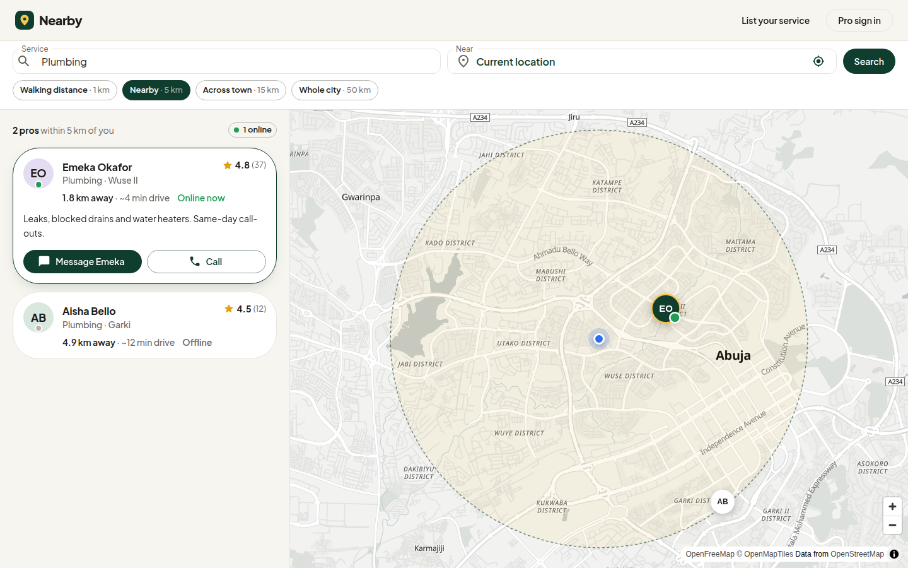

**Stack:** React 19 · Vite · MUI · MapLibre · Socket.IO · Node 24 · Express 5 · MongoDB (geospatial) · Redis

## Walkthrough

<table>
  <tr>
    <td width="50%">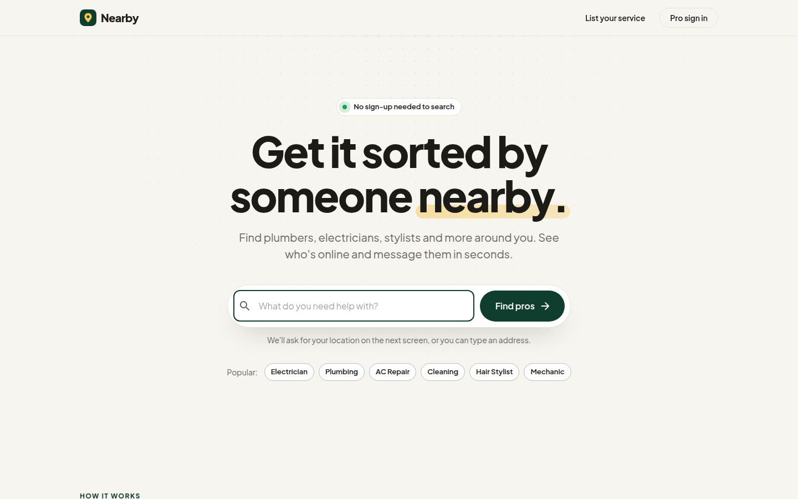<br><sub><b>1.</b> One question to start. No sign-up for customers.</sub></td>
    <td width="50%">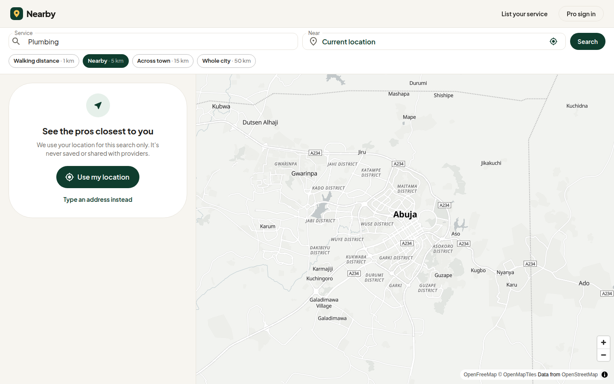<br><sub><b>2.</b> Location is asked for with a reason, before the browser prompt.</sub></td>
  </tr>
  <tr>
    <td>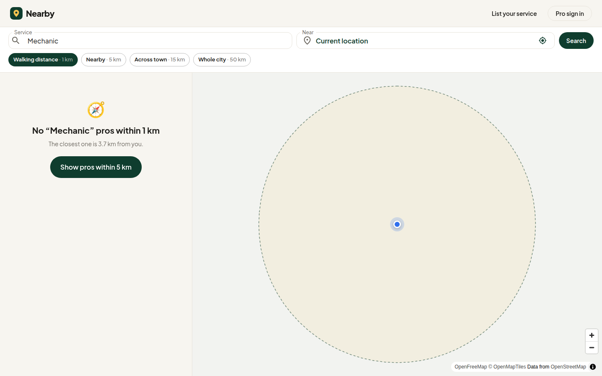<br><sub><b>3.</b> Nothing in range? Here's how far the nearest is, plus one tap to widen.</sub></td>
    <td>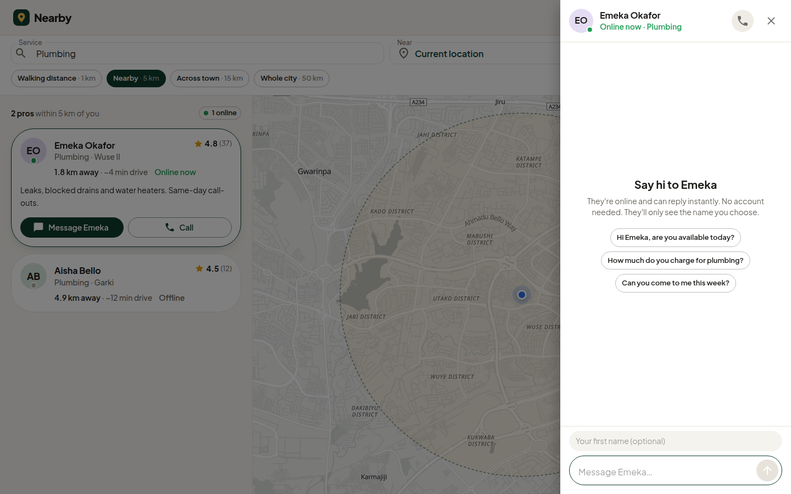<br><sub><b>4.</b> Conversation starters remove blank-box hesitation.</sub></td>
  </tr>
  <tr>
    <td>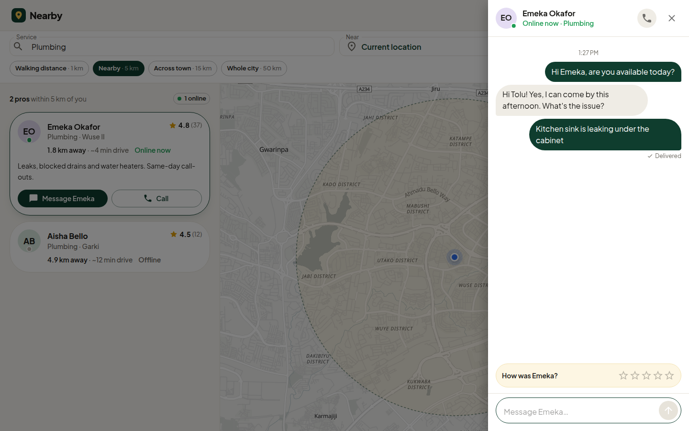<br><sub><b>5.</b> Delivery receipts. The rating ask appears only after a reply.</sub></td>
    <td>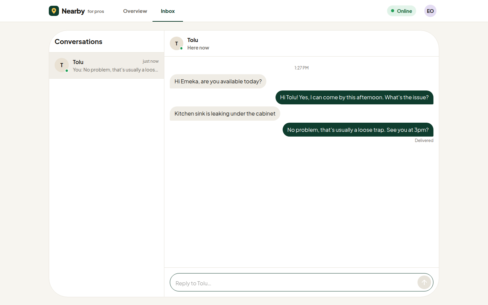<br><sub><b>6.</b> The provider's side, live.</sub></td>
  </tr>
  <tr>
    <td>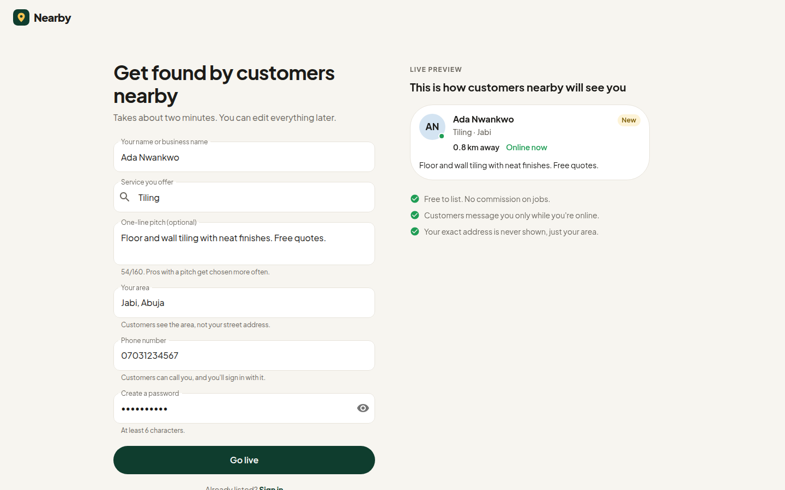<br><sub><b>7.</b> Providers see their listing take shape as they type.</sub></td>
    <td>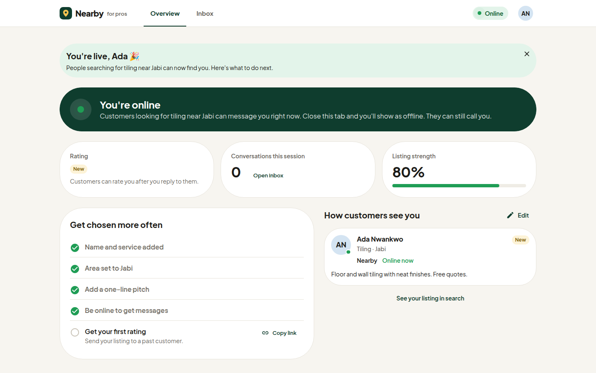<br><sub><b>8.</b> Signed straight in, with a checklist that starts mostly done.</sub></td>
  </tr>
</table>

<p align="center">
  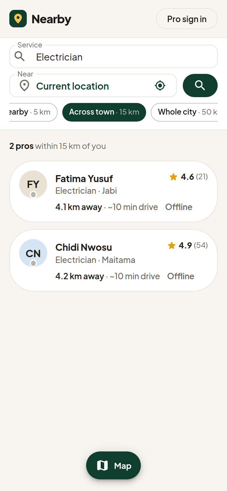
  &nbsp;&nbsp;
  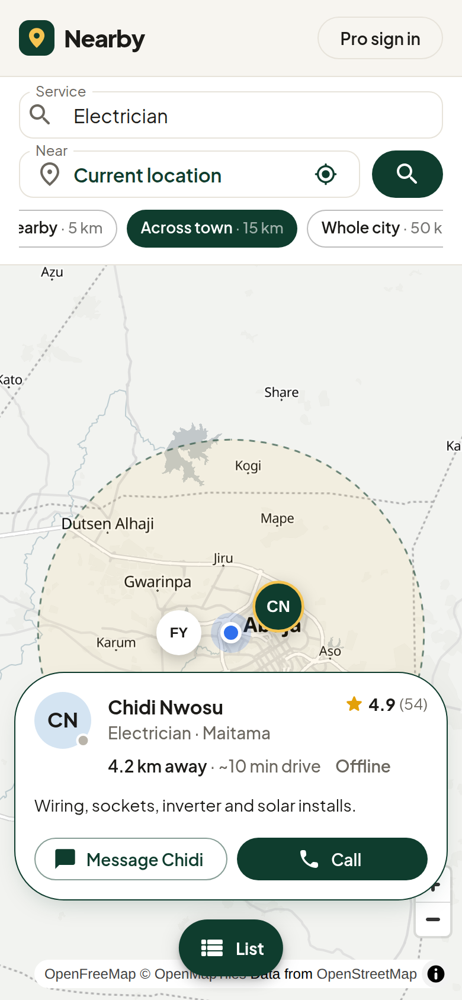
</p>

---

## The psychology behind the features

Most of the work in this project isn't the map or the socket plumbing. It's the decisions about *when* to ask for things, *what* to show when there's nothing to show, and how to keep two strangers confident that the other side is real. Each decision below exists because of a specific moment of doubt.

### For the customer: remove every reason to hesitate

| Moment | Decision | Why |
| --- | --- | --- |
| Arriving | **One field, one button.** The hero asks only *"What do you need help with?"* Location comes on the next screen. | Every extra input on the first screen costs people. Ask for the thing they already know first. |
| Wanting to search | **No sign-up, ever, for customers.** Only providers have accounts. | Asking for an account before showing any value is the most common reason people leave. Customers get value first. Providers sign up because the account *is* the value for them. |
| The location prompt | **A soft ask before the browser prompt.** It explains why and promises the location isn't stored. It's skipped entirely if permission was granted before. If denied, it moves straight to "type an address instead". | A browser "Block" is effectively permanent. You get one shot, so prime the decision rather than ambush people on page load. |
| Choosing a radius | **Distance in human terms:** *Walking distance · Nearby · Across town · Whole city*, and *"1.8 km away · ~4 min drive"* on each card. | Nobody thinks "5,000 meters". People think in trips. |
| Reading results | **The search radius is drawn on the map.** | The circle answers "why am I seeing these and not others?" without a word of copy. |
| Zero results | **No dead ends.** *"No mechanics within 1 km. The closest one is 3.0 km from you."* → **[Show pros within 5 km]**. If nobody offers it at all, show popular services that do exist. | An empty state is a decision point, not an error. The API returns the nearest match when the radius is empty, so the UI can offer a precise next step. |
| Comparing | **Progressive disclosure.** Cards show name, rating, distance and status. Bio and actions appear only once you pick one. | Compare first, act second. Ten cards with twenty buttons is noise. |
| Is anyone there? | **Live presence.** A green dot means a provider is connected *right now*, and it updates live while you browse. Offline pros get **Call** as the primary action, and the chat box is replaced by an honest explanation. | The worst outcome is a message sent into the void. Never offer an action that will silently fail. |
| The first message | **Conversation starters** (*"Hi Emeka, are you available today?"*) and an optional first name. | The blank text box is the hardest part of reaching out to a stranger. One tap lowers that barrier. |
| Waiting | **Delivery receipts, typing indicator, and the chat opens over the map** so you never lose your place. | Uncertainty feels longer than waiting. "Delivered" and "typing…" turn silence into progress. |
| After the reply | **The rating prompt appears only after the provider has replied**, inline, as one tap. The thank-you is social: *"Your rating helps your neighbours choose."* | Ask at the moment of relevance, not via a pop-up on arrival. People rate more when they can see who benefits. |
| New providers | **"New" instead of 0.0 stars.** | A zero reads as *bad*, not *unknown*. Don't punish newcomers for the cold-start problem. |

### For the provider: make the payoff visible before the work

| Moment | Decision | Why |
| --- | --- | --- |
| Signing up | **A live preview of your listing updates as you type**: *"This is how customers nearby will see you."* | It turns an abstract form into something you're building and starting to own. It also nudges better bios without nagging. Validation only fires after you leave a field, never mid-keystroke. |
| Submitting | **Signing up signs you in** and lands on *"You're live, Ada 🎉"* with what to do next. | "Account created, now log in" is a pointless second hurdle at the moment of highest motivation. |
| First visit to the dashboard | **A listing-strength checklist that starts mostly done** (3 of 5), with one-click actions such as *Copy link* to get your first rating. | Progress that is visibly close to done gets finished (the goal-gradient effect). The last item doubles as a growth loop. |
| Every visit | **Online status leads the dashboard**, with honest copy: *"Close this tab and you'll show as offline. They can still call you."* | Being reachable is what providers care about most, so it gets the most prominent spot, and it's never overstated. |
| Looking elsewhere | **Toasts for new messages and ratings, and an unread count in the tab title** (*"(2) Nearby for pros"*). | Providers juggle tabs. Bring them back without making them watch the screen. |

### Small things that add up

- **Search state lives in the URL** (`/search?service=Plumbing&radius=15000`), so results can be shared, bookmarked and walked back with the browser's Back button.
- **Skeleton cards, not spinners**, and the search form never disappears while loading.
- **Mobile is a first-class layout**, not a squeezed desktop: a list/map toggle, and tapping a pin raises a card above it.
- **Respects `prefers-reduced-motion`**, keyboard-operable cards, and no nested interactive elements.
- **"Explore with a demo account"** on the sign-in page, so anyone evaluating the app is one click from the provider side.

---

## Try it

### With Docker (everything included)

```bash
cp .env.example .env                       # then set SECRET_KEY
docker compose up --build
docker compose exec api npm run seed       # 20 demo providers around Abuja
```

Open **http://localhost:3000**. To see both sides of a conversation, use two browser windows: in one, sign in with **Explore with a demo account** (Emeka, a plumber in Wuse II). In the other, search for *Plumbing* near *Wuse 2, Abuja* and message him.

Demo login: `08000000001` / `demo1234`. All seeded providers share that password, with phone numbers `08000000001`–`08000000020`.

### Local development

Requires **Node 22+** (Node 24 LTS recommended) and MongoDB. Redis is optional.

```bash
# API
cd serviceRenderers
cp .env.example .env          # set MONGO_URI and SECRET_KEY
npm install
npm run seed                  # optional demo data (--reset to wipe first)
npm run dev                   # http://localhost:5000, restarts on change

# Web (second terminal)
cd www/web
cp .env.example .env
npm install
npm run dev                   # http://localhost:3000
```

No API keys are needed. Geocoding uses OpenStreetMap's Nominatim and map tiles come from OpenFreeMap. Set `GEOCODER_PROVIDER` / `GEOCODER_API_KEY` to switch to Google, MapQuest, OpenCage, etc.

---

## How it works

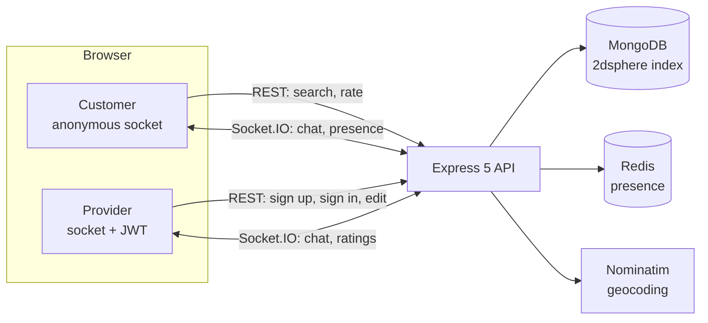

- **Geo search.** A single `$geoNear` aggregation with the service filter inside its `query`, so the 2dsphere index does the work and results come back nearest-first with distances. If the radius is empty, a second, unbounded `$geoNear` with `limit 1` finds the nearest match for the "widen search" prompt. User input is regex-escaped.
- **Presence.** Providers connect their socket with a JWT in the handshake. The server maps `providerId ↔ socketId` in Redis (or memory when Redis isn't configured) and broadcasts `presence:changed`. Search results are annotated with `online` in one batched lookup. Multiple tabs are handled: closing an old tab doesn't mark you offline if a newer one is connected.
- **Chat.** Customers are identified only by their socket id. Every message uses Socket.IO acknowledgements, so the sender sees *Delivered*, *Not delivered* (with retry), or *Customer had left*.
- **Ratings.** A running average is folded in atomically with an update pipeline (`rating = (rating × count + score) / (count + 1)`), so concurrent ratings can't race. The provider's dashboard updates live.
- **Frontend.** Routes are lazy-loaded. The landing page is about 124 KB gzipped, and MapLibre loads only when a map is needed.

### API

Base path `/api/v1/services`. Responses use `{ response: boolean, payload }`, and error payloads are human-readable strings.

| Method | Path | Auth | Purpose |
| --- | --- | --- | --- |
| `POST` | `/search` | n/a | `{ service, meters, lng, lat }` or `{ service, meters, address }` → `{ results, center, meters, nearest }` |
| `GET` | `/popular` | n/a | Services ranked by number of providers (powers suggestions) |
| `POST` | `/` | n/a | Register a provider; returns `{ user, token }` |
| `POST` | `/login` | n/a | `{ phoneNumber, password }` → `{ user, token }` (rate-limited) |
| `GET` | `/me` | Bearer | Current provider, with `online` |
| `PATCH` | `/me` | Bearer | Update name, service, bio, area (re-geocoded) or password |
| `DELETE` | `/me` | Bearer | Delete account |
| `GET` | `/:id` | n/a | Public provider profile |
| `POST` | `/:id/ratings` | n/a | `{ score }` (1–5) or the five category scores (rate-limited) |
| `GET` | `/health` (root) | n/a | Liveness and Mongo status |

### Socket events

| Event | Direction | Payload |
| --- | --- | --- |
| `chat:send` | customer → server | `{ providerId, body, name }`, ack `{ delivered, reason? }` |
| `chat:reply` | provider → server | `{ conversationId, body }`, ack `{ delivered, reason? }` |
| `chat:message` | server → both | `{ from, body, at, … }` |
| `chat:typing` | both ways | `{ providerId }` or `{ conversationId }` |
| `chat:left` | server → provider | `{ conversationId }` when the customer disconnects |
| `presence:changed` | server → all | `{ providerId, online }` |
| `rating:updated` | server → provider | `{ rating, ratingCount, score }` |

### Project layout

```
serviceRenderers/          Express API
  src/config.js            env validation
  src/server.js            HTTP + Socket.IO (presence, chat)
  src/routes/              REST endpoints
  src/dao/                 Mongo queries ($geoNear, rating pipeline)
  src/utils/               geocoder, presence store, helpers
  src/scripts/seed.js      demo data
www/web/                   React app (Vite)
  app/pages/               Landing, Search, Join, Login, dashboard/
  app/components/          ProviderCard, MapView, ChatDrawer, …
  app/context/             Auth, Socket, Inbox state
compose.yml                web + api + mongo + redis
```

---

## What changed in v2

This started as an earlier project of mine and was rebuilt in 2026:

- **Security:** removed credentials committed to source and compose; login no longer returns the password hash; update and delete now require auth and act only on your own account; uniform login errors; rate limiting; Helmet; validated config; CORS allow-list.
- **Correctness:** registration had been broken by a dead geocoding key; the client sent its token as `[object Object]`; the DAO swallowed errors and returned them with HTTP 200; ratings overwrote instead of averaging; the server wouldn't start without a specific hosted Redis.
- **Platform:** Node 24 · Express 5 · Mongoose 9 · React 19 · Vite (replacing the deprecated Create React App) · MUI 9 · MapLibre with keyless tiles (replacing a borrowed Mapbox token).
- **Product:** the customer flow went from a login-gated form with a raw "meters" field to everything described above. Placeholder charts and fake billing pages were removed rather than kept as decoration.

## Known limitations and next steps

- **Chat isn't persisted.** Conversations live for the session, by design for anonymous customers. Next: store threads and let a customer leave a phone number for offline pros.
- **Ratings aren't tied to a verified conversation** (rate-limited only). Next: issue a one-time rating token when a provider replies.
- **Presence assumes one API instance.** Scaling out needs the Socket.IO Redis adapter. The presence store is already in Redis.
- **Public Nominatim** is fine for demos but has a 1 request/second policy. Use a paid geocoder or self-host for production.
- `consumers/` (an early prototype service) and `www/servicemgtapp/` (the original CRA client) are legacy and aren't used by `compose.yml`.
